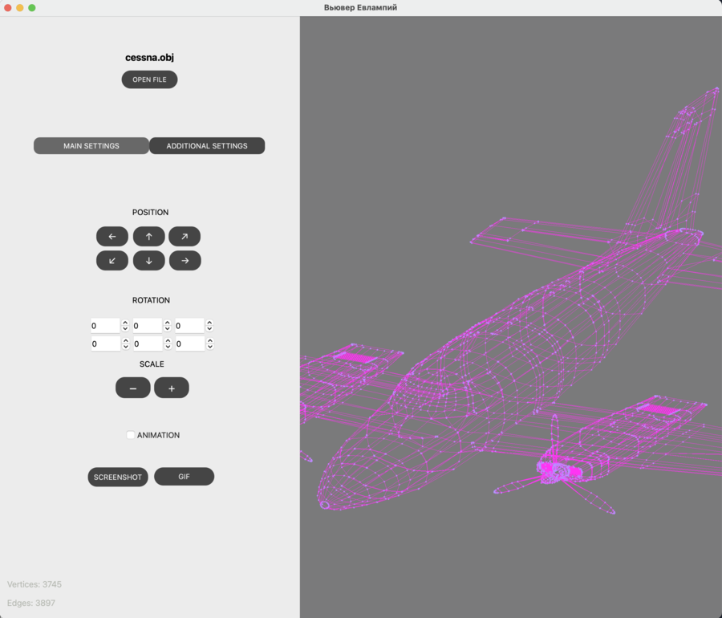

# my_3DViewer

## Пример:

### Программа для просмотра 3D моделей в каркасном виде 3D Viewer.
- Программа предоставляет возможность:
    - Загружать каркасную модель из файла формата obj (поддержка только списка вершин и поверхностей).
    - Перемещать модель на заданное расстояние относительно осей X, Y, Z.
    - Поворачивать модель на заданный угол относительно своих осей X, Y, Z
    - Масштабировать модель на заданное значение.
    
- Графический пользовательский интерфейс содержит:
    - Кнопку для выбора файла с моделью и поле для вывода его названия.
    - Зону визуализации каркасной модели.
    - Кнопки и поля ввода для перемещения модели. 
    - Кнопки и поля ввода для поворота модели. 
    - Кнопки и поля ввода для масштабирования модели.  
    
- Программа позволяет настраивать тип проекции (параллельная и центральная), тип линий (сплошная, пунктирная), цвет и толщину ребер, способ отображения (отсутствует, круг, квадрат), цвет и размер вершин
 - Возможен выбор цвета фона
 - Настройки сохраняются между перезапусками программы
 - Есть возможность делать скриншот модели и сохранять gif-анимацию.
